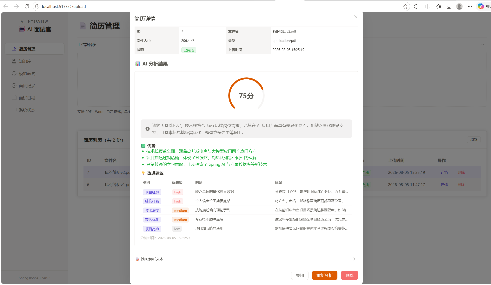
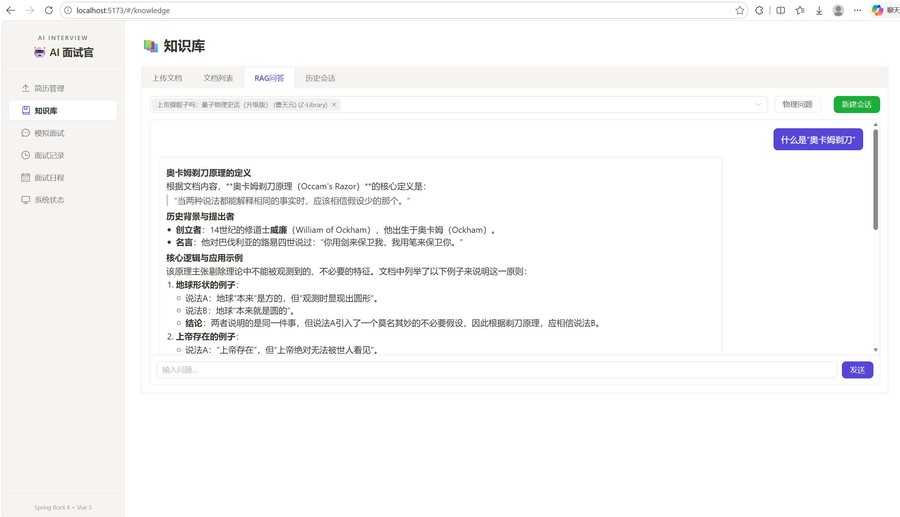
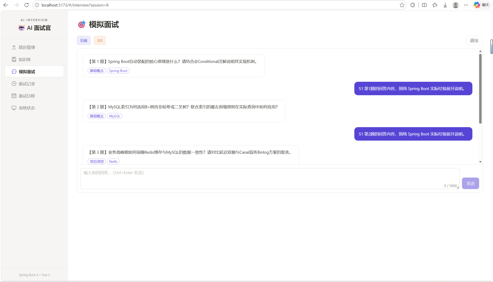
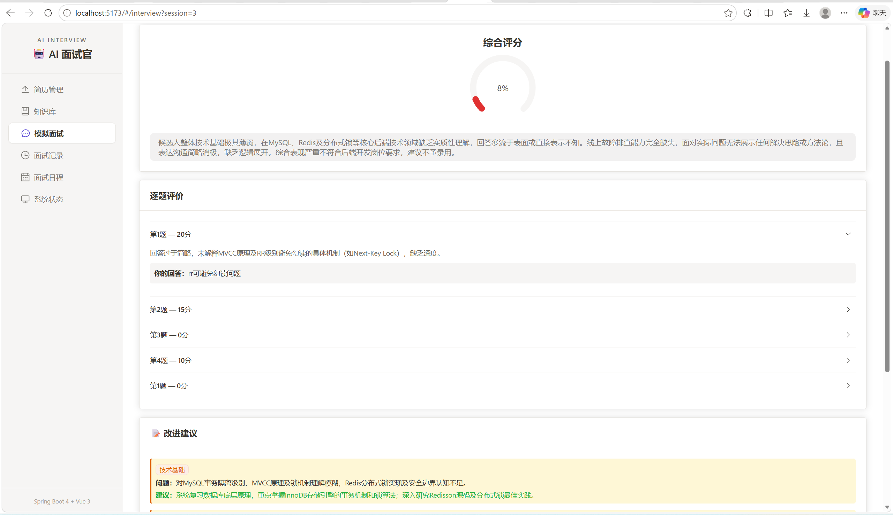

# AI-Interview

> AI 模拟面试平台：上传简历做 AI 分析，根据简历和岗位 JD，自动生成有针对性的面试题，逐题作答后输出多维度评估报告；同时提供基于个人文档的 RAG 知识库问答。

| 简历分析 | 知识库 RAG 问答 |
|:---:|:---:|
|  |  |
| 上传简历 → 解析 → AI 评分与改进建议 | 文档入库 → 向量化 → 检索增强的多轮问答 |

| 模拟面试 | 评估报告 |
|:---:|:---:|
|  |  |
| 按「简历 + JD + 方向」出题，聊天式作答 | 四维度评分 + 逐题点评 + 优势/改进项 |

## 功能

| 模块 | 工程细节 |
|---|---|
| 📄 **简历分析** | 支持 PDF/Word/TXT，解析后**异步**调 LLM；同文件 MD5 秒传，可反复重分析并保留历史 |
| 💬 **知识库问答** | 分片上传 → 解析 → 向量化 → 检索增强；多轮对话 + **SSE 流式输出** |
| 🎯 **模拟面试** | 一次性生成整套题目（保证梯度与题型覆盖），**答题过程中后台已在分批评分** |
| 📊 **评估报告** | 四维度加权评分；评估链路带**降级兜底**，任何情况都有报告返回 |
| 📤 **大文件上传** | 分片 + 断点续传 + 秒传，面向 100MB+ 文档；弱网中断后只补传缺失分片 |

## 技术栈

| | |
|---|---|
| **后端** | Spring Boot 4 · Java 21 · MyBatis-Plus · PostgreSQL + pgvector · Redis · 阿里云 OSS · 通义千问（DashScope） |
| **前端** | Vue 3 · Vite · Element Plus |

## 技术要点

### 1. 大文件分片上传与内容级去重

- 前端按 **5MB** 切片并发上传，Redis `Set` 追踪已传分片 → 失败只补传缺失片；MD5 命中直接秒传
- **合并由前端统一触发**：后端逐片自动检测会有竞态——最后几片几乎同时到达，多个线程同时发现"凑齐了"并下发合并指令
- 三层防重复入库：Redis 状态拦截 → Redisson 分布式锁（`tryLock` + WatchDog 自动续期）→ 数据库唯一索引兜底

### 2. Redis Stream 异步解耦

- 所有 LLM 任务（简历分析 / 文档向量化 / 面试评估）走 Redis Stream 异步消费，**提交接口只做入库 + XADD 就返回**
- 模板方法模式抽象 `AbstractStreamProducer` / `AbstractStreamConsumer`，三条业务链路复用同一套基础设施，新增异步任务只需写两个几十行的子类
- 失败自动重发（最多 3 次）；**无论成败都 ACK 原消息**防止 Pending 堆积；应用重启自动补发卡在 `EVALUATING` 的会话

### 3. Prompt 注入三层纵深防御

用户简历、文档正文、面试回答全部会拼进 Prompt，攻击面很大。三层机制完全不同，同时失效概率极低：

1. **输入净化** — 正则匹配已知注入模式（角色标记、指令覆盖、分隔符伪造），配置在 JSON 里与代码解耦
2. **动态分隔符** — 每次调用生成随机 UUID 标签包裹用户数据，攻击者无法预测、无法提前闭合
3. **输出护栏** — 检测 LLM 输出中的"投降语"（承认被注入成功的标志性话术），命中即拦截

简历分析、面试出题/评估、知识库作答等 LLM 调用统一走 `IPromptDefenseService`，每层可独立开关。

### 4. RAG 问答链路

- **自研字符制重叠分块器**：Spring AI 内置的 `TokenTextSplitter` 没有 overlap 参数，且 `chunkSize` 单位是 token 不是字符——中文场景下会切出平均 1100+ 字符的巨块且相邻块零重叠。改为按句边界切分 + 贪心装箱，500 字符/块、相邻重叠 80 字符且对齐句首
- **Query Rewrite**：调用 LLM 改写用户口语化提问、消解多轮对话中的指代（"它""这个"），改写失败或超长自动回退原问题
- **检索**：pgvector 余弦相似度 + `kb_id` 元数据过滤；过滤表达式异常时降级为无过滤检索 + 应用层过滤
- **流式输出**：SSE 逐字推送；前 120 字做**探测窗口**，检测到"未找到相关信息"类拒答立刻截断替换，用户不会看到半句废话

### 5. 面试的增量分批评估

- 传统做法是答完所有题再统一评估，用户要干等十几秒。这里改成**每答完 4 题后台异步评估一批**，结果缓存 Redis；用户提交时所有批次已就绪，只需 1 次 LLM 汇总
- **降级链**：LLM 汇总失败 → 纯代码拼接各批次得分；批次不齐 → 退回全量评估。任何情况下都有报告返回，不会出现"评估失败请重试"

### 6. 请求级分段耗时观测

- 自研 `StageWatch` 给每次 RAG 问答输出一行分段耗时（改写 / 检索 / Prompt 构建 / LLM 首字 / 流首字 / 生成）+ 命中块数、上下文体积
- 凭这一行埋点定位到"RAG 慢"的主因**不是检索**（检索仅 0.2~0.6s），而是模型默认开启了思考模式，每次调用先产出完整思维链。关闭后端到端 **32.0s → 7.8s**，答案反而更完整

## 项目结构

```
backend/    Spring Boot 后端（按模块分包：common / config / stream / file / resume / knowledge / interview）
frontend/   Vue 3 前端
docs/       工程文档：现状基线、模块实现、数据模型、接口清单、任务清单、检索评测
CLAUDE.md   开发规范（流程、编码约定、文档机制）
```

## 快速开始

```bash
# 1. 依赖服务（需要带 pgvector 的 PG 镜像）
docker run -d --name postgres-service -p 5432:5432 -e POSTGRES_PASSWORD=123456 pgvector/pgvector:pg16
docker run -d --name my_redis -p 6380:6379 redis:7 --requirepass 123456
# 建库 ai_interview 并启用 vector 扩展，建表脚本见 docs/sql/schema.sql

# 2. 配置密钥
cd backend && cp .env.example .env    # 填入 DashScope API Key 与阿里云 OSS AccessKey

# 3. 启动后端
mvn spring-boot:run                    # Swagger: http://localhost:8080/swagger-ui.html

# 4. 启动前端
cd ../frontend && pnpm install && pnpm dev   # http://localhost:5173
```

> 未配置密钥时应用仍能启动，但 LLM / Embedding / OSS 相关功能不可用（`GET /api/health` 会显示对应项为 DOWN）。

## 文档

仓库内 `docs/` 是完整的工程知识库，与代码同步维护：

| 文档 | 内容 |
|---|---|
| `docs/00-现状基线.md` | 技术栈、基础设施、功能矩阵、横切机制、已知坑位 |
| `docs/01-数据模型.md` + `docs/sql/schema.sql` | 数据库表结构、Redis/Stream key 清单、可执行 DDL |
| `docs/02-接口清单.md` | 全部 REST / SSE 接口契约 |
| `docs/03-任务清单.md` | 任务进度与每项验收记录 |
| `docs/modules/` | 各功能模块的实现细节与踩坑记录 |
